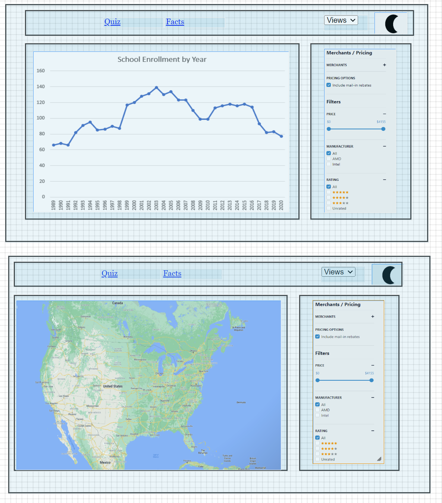
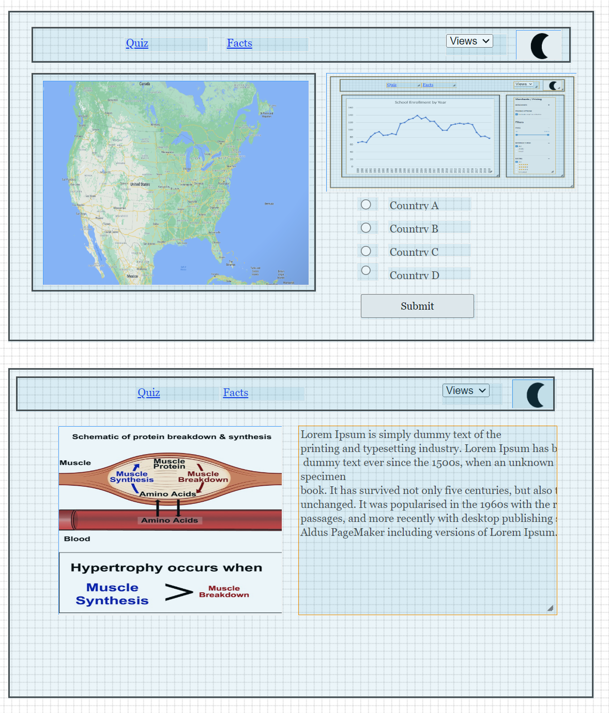

# GDPro

## Data
GDP dataset
Summary: This dataset contains data about the yearly gdp of each country, from 1990 up to 2020
Link: https://ourworldindata.org/grapher/gdp-per-capita-worldbank

Protein dataset
Summary: This dataset contains data about the average daily protein intake of each country, from 1990 up to 2020
Link: https://ourworldindata.org/grapher/daily-per-capita-protein-supply

## API
GDP dataset endpoints

Endpoint: GET /countries/:country?startYear=int&endYear=int
Description: Get gdp of a country for a range of years
Returns: a json object containing the requested country, country code, and an array of objects that consist of the year and gdp for that year

Endpoint: POST /years/:year
Request body: list of countries to include. No countries specified = all included
Description: Get gdp of a range of countries for a specific year
Returns: a json object containing the year, and an array of objects that consist a country name, country code, and gdp for that year

Protein dataset endpoints

Endpoint: GET /countries/:country?startYear=int&endYear=int
Description: Get daily protein intake of a country for a range of years
Returns: a json object containing the requested country, country code, and an array of objects that consist of the year and protein intake for that year

Endpoint: POST /years/:year
Request body: list of countries to include. No countries specified = all included
Description: Get daily protein intake of a range of countries for a specific year
Returns: a json object containing the year, and an array of objects that consist a country name, country code, and protein intake for that year

## Visualizations: describe the visualization(s), what you want to the user to learn, what story you want to tell with your data,

Our goal is to provide an easy interface for visualizing the GDP all around the world, dating from the 1990s
At the same time, we want to demonstrate the correlation between a country's GDP and its average daily amount of protein intake 

We also have 2 separate sections apart from visualization:
- A page to provide the user some scientific information, for example how muscle-protein synthesis, or what factors impact the GDP of a country
- A page that serves as a "test your knowledge", where you have to guess the country based on a chart containing data about the gdp and protein intake,
as well as the map to limit the amount of possible options (ex. this country is in Europe)

## Views

Our current website design includes 4 pages:
- Map view : contains a map on which will be displayed pinpoints in all countries and some data about the gdp/protein in each pinpoint. On the right side of the map will be found various filters to alter the output on the map
- Chart view : contains a chart on which will be observed the evolution of the gdp and protein intake of a specific country over a span of years. Just like the map view, the chart will have filters to its right with which you will be able to filter through the data that you want display on the chart
- Quiz : consists of a page to test your knowledge about the gdp and protein intake of countries all around the world. Each question will require you to guess a certain country out of 4 options, given a chart with some data about the gdp and protein, as well as a map to narrow down the area where that country could be located
- Facts : contains science-based information about various topics related to gdp and protein. It will be an informative page where the user will get to know more about the gdp and protein

Each webpage is accompanied by a navbar at the top, where you can select which out of 4 pages you want to display, as well as a dark/light mode switch

## Functionality:

- For the map and chart view, the user will be able to hover over the map or chart and see what kind of data each pin point presents. Moreover, both
will have filters, for example to filter, through the years, countries, etc.
- On the quiz page, the hovering feature will also be available, and the user will be able to select one of the 4 country options
- On the facts page, the user will mainly be presented with images and information, as well as a "reroll" button where the user will be presented with a new fact

## Features and Priorities: identify the core features versus aspects you might potentially cut if the core features take longer than expected to implement

Core:
- Data visualization on the map
- Filters for the map (basic)
- Data visualization on the chart
- Filters for the chart (basic)
- Quiz page

Additional:
- Facts page (note: this will be our number one priority for the additional features, however we want to first ensure that the 3 other pages are fully functional before tackling down a 4th one)
- Filters for the map (enhanced)
- Filters for the chart (enhanced)
- Map on the quiz page

## Dependencies:

We will use:
- react-leaflet to visualize the data on the map for the map view page
- react-plotly to visualize the data on a chart or graph for the chart view page